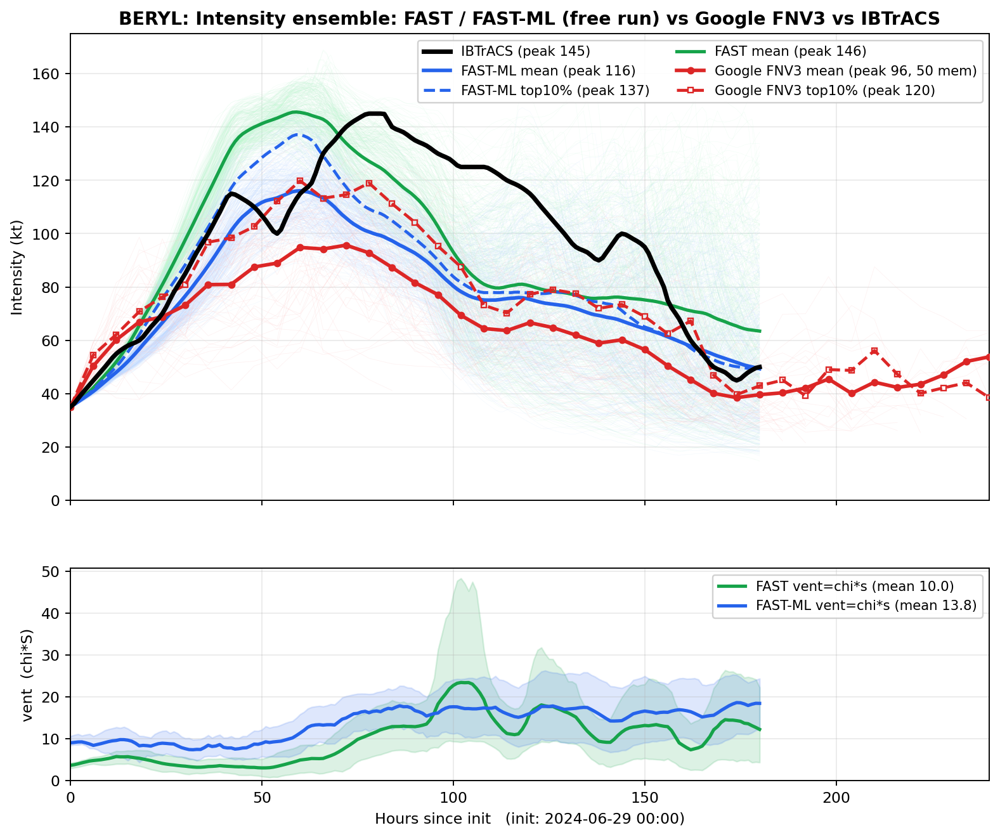
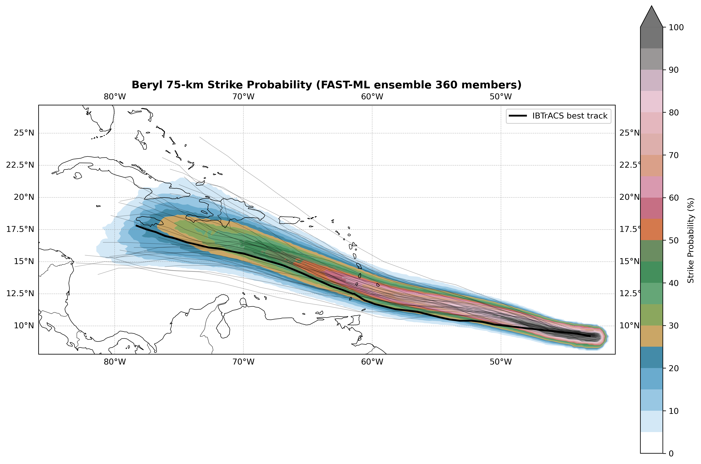
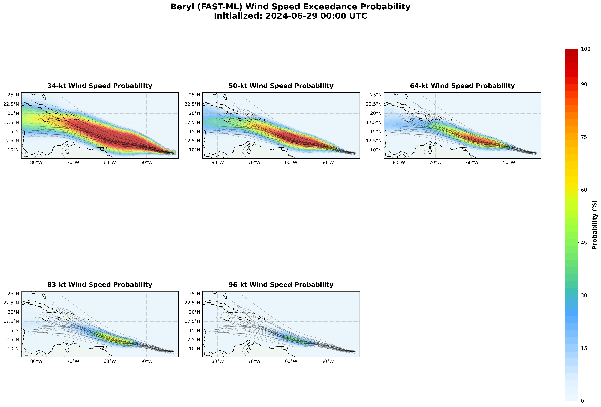

<div align="center">

# FAST-ML: A Hybrid Physics–Machine Learning Framework for Tropical Cyclone Intensity Forecasting

[-B31B1B)](#citation)
[](#reproduction)
[](requirements.txt)
[](LICENSE)

</div>

Code and data for the manuscript submitted to *Journal of Advances in Modeling
Earth Systems* (JAMES). Inference only: the training loop and the derivation of
the ERA5 ventilation diagnostics are not part of this release.


## Reproduction

```bash
git clone https://github.com/Shijie-Xiao/FAST_ML.git
cd FAST_ML
pip install -r requirements.txt
```

**Figures only — no download, no GPU, ~1 min.**

```bash
python scripts/run_single_track.py --replot-only
python scripts/plot_ensemble_vs_google.py --no-vent-panel
python scripts/plot_figure3.py
```

**With the ensemble ventilation panels — 66 MB.**

```bash
python scripts/download_data.py --ensemble
python scripts/plot_ensemble_vs_google.py
```

**Run the model end to end — 2.1 GB, ~1 min on a GPU.** Reruns the CNN and the
ODE and rewrites the NetCDF, figures and metrics from scratch.

```bash
python scripts/download_data.py --single-track
python scripts/run_single_track.py --years 2024 --basin NA
```
```
Storms evaluated          : 12  (7 skipped)
Mean RMSE, FAST           : 15.42 kt
Mean RMSE, FAST_ML        : 10.78 kt
Mean improvement          : +4.64 kt
Storms where FAST_ML wins : 10/12
```

Seven of the nineteen 2024 storms are excluded by the evaluation criteria: they
either never reach the 45 kt forecast threshold or have under 72 h of forecast
after it. `download_data.py --verify` reports which inputs are present, and
`--storm MILTON` runs a single storm.

## Results


RMSE against the IBTrACS best track over the full forecast period for the 2024
test season, in knots (panel D of the figure):

| Storm | Obs peak | FAST | FAST-ML | Gain |
|---|---:|---:|---:|---:|
| BERYL | 145 | 12.78 | 10.35 | +2.42 |
| DEBBY | 70 | 18.60 | 16.32 | +2.28 |
| ERNESTO | 85 | 10.31 | 10.68 | −0.37 |
| FRANCINE | 90 | 4.96 | 2.92 | +2.04 |
| HELENE | 120 | 9.02 | 6.85 | +2.17 |
| ISAAC | 90 | 28.97 | 9.17 | +19.80 |
| KIRK | 130 | 20.59 | 14.90 | +5.69 |
| LESLIE | 90 | 21.78 | 14.11 | +7.67 |
| MILTON | 155 | 29.24 | 19.81 | +9.43 |
| OSCAR | 75 | 8.40 | 5.70 | +2.70 |
| PATTY | 55 | 3.21 | 6.03 | −2.81 |
| RAFAEL | 105 | 17.20 | 12.52 | +4.68 |
| **mean** | | **15.42** | **10.78** | **+4.64** |

Across all 224 North Atlantic storms of 2003-2024 that meet the same criteria,
FAST averages 18.20 kt and FAST-ML 13.87 kt (−4.33 kt), with FAST-ML better on
179 of the 224. Scoring those years needs the full ERA5 archive, which is not
distributed; per-storm metrics for every run land in `results/` locally.

## Ensemble forecasting

A GEFS-based synthetic track ensemble drives FAST and FAST-ML member by member,
giving a full intensity distribution to compare against the Google WeatherLab
FNV3 ensemble and IBTrACS. Retaining the ODE means the spread is generated by
physics, so the ensemble keeps the right-skewed tail that a model trained
towards the conditional mean damps out. On Hurricane Beryl (July 2024, from
the held-out season), 31 raw GEFS members expand to a 360-member ODE ensemble
over the 5-day window:

| Case | Obs peak | FAST-ML mean | FAST-ML top 10% | FNV3 mean | FNV3 top 10% | FAST mean |
|---|---:|---:|---:|---:|---:|---:|
| Beryl (2024, held-out) | 145 | 116 | **137** | 96 | 120 | 146 |

Peak intensity in knots; "mean" is the peak of the ensemble-mean track and
"top 10%" that of the mean of the strongest decile of members. Beryl's
category-5 peak (145 kt) sits inside the FAST-ML distribution: the strongest
decile reaches 137 kt, within 8 kt of the observed peak, while the mean,
weighed down by the members that shear out over the central Caribbean, peaks
at 116 kt. The 50-member FNV3 ensemble initialised at the same time
undershoots at both the mean (96 kt) and the top decile (120 kt); pure FAST
overshoots (146/158 kt). The FAST-ML distribution brackets the observation
where the NWP ensemble falls short.



*Beryl (2024, held-out), initialised 2024-06-29 00:00 UTC, 360 ODE members vs
the 50-member FNV3 ensemble and the best track. Top: the FAST-ML intensity
ensemble with its mean and top decile. Bottom: per-member ventilation index.
The Flossie and Priscilla (2025) cases produce the same set of figures.*

### Strike probability

The same ensemble feeds two probabilistic products, following the wind model of
Lin & Chavas as used in the reference implementation: the probability that the
storm centre passes within 75 km of a point over a 5-day window, and the
probability that the modelled wind speed exceeds 34/50/64/83/96 kt. The 31 raw
GEFS members are drawn as spaghetti; the probabilities use the full sampled
ensemble.

```bash
python scripts/plot_strike_probability.py --case beryl --model ml
```



*Beryl (2024, held-out): 75-km strike probability of the 360-member FAST-ML
ensemble, with the 31 raw GEFS members as spaghetti and the IBTrACS best
track on top.*



*Beryl (2024, held-out): probability of the modelled wind speed exceeding
34/50/64/83/96 kt, each panel zoomed to the track domain. The corresponding
Flossie and Priscilla maps are written alongside these in `results/ensemble/`.*

## Data

Everything needed to redraw the published figures is in git (about 30 MB): the
model weights, the drag coefficient field, the normalisation statistics, the
ensemble ODE output and FNV3 reference. Four larger files live on
[Google Drive](https://drive.google.com/drive/folders/1xS8JN65WVqhkvLeBnrNZBRg47XE4lIUf),
with ids and SHA-256 sums in `data/manifest.json`:

| File | Size | Needed for |
|---|---|---|
| `fastml_training_data_2024_NA.tar` | 2.1 GB | running the CNN on the 2024 season |
| `chi_s_beryl.nc` | 13 MB | ventilation panel, Beryl |
| `chi_s_flossie.nc` | 17 MB | ventilation panel, Flossie |
| `chi_s_priscilla.nc` | 35 MB | ventilation panel, Priscilla |

`download_data.py` verifies size and SHA-256 after each transfer. Training data
is not distributed — only the 2024 North Atlantic test season. The
normalisation statistics are part of the model definition and are committed
(`data/spatial_stats_train2003_2022.pkl`, under 1 KB).

## Method

- **Time axis.** The forecast starts when the best track first reaches 45 kt;
  the preceding 48 h initialise the ODE.
- **Initialisation.** Over the 48 h window `V` is nudged onto the observation
  and the residual `F = observed acceleration − physics RHS` is recorded. From
  `t_start` the integration is free, with the inherited forcing decaying as
  `F * exp(−2 * (lead / 24 h)^2)`.
- **Observation inversion.** Best-track winds include translation and
  shear-induced asymmetry; observations are inverted to axisymmetric form
  before use, and model output is converted back for scoring.
- **Ventilation calibration.** Both paths apply the same mean-to-90th-percentile
  factor and the same Atlantic ceiling, putting ERA5 and CNN ventilation
  indices on one scale.
- **Two streams.** `S` is diagnosed from (U, V, Z) and `chi` from (T, Q, SST,
  MSLP). Both are per-timestep diagnostics, so all temporal evolution comes
  from the ODE.

## Layout

```
fastml/   Two-stream CNN, FAST ODE, data loading, inference, I/O, plotting
scripts/  run_single_track, plot_ensemble_vs_google, plot_figure3,
          plot_strike_probability, download_data
ckpt/     Released weights (4.7 MB, strict load)
data/     Drag field, normalisation statistics, ensemble inputs, manifest
img/      Figures referenced by this README (manuscript figures + ensembles)
results/  Generated output — NetCDF, metrics, figures (gitignored)
```

## Data sources

IBTrACS v04 best-track data (NOAA NCEI), ERA5 reanalysis (Copernicus Climate
Change Service), GEFS reforecasts (NOAA), Google WeatherLab FNV3 ensemble
forecasts.

## Citation

```bibtex
@article{xiao_fastml,
  title   = {{FAST-ML}: A Hybrid Physics--Machine Learning Framework for
             Tropical Cyclone Intensity Forecasting},
  author  = {Xiao, Shijie and Lin, Jonathan and Ehrmann, Thomas and
             Sarhadi, Ali},
  journal = {Journal of Advances in Modeling Earth Systems},
  note    = {Submitted},
  year    = {2026}
}
```

## License

MIT, see `LICENSE`.
