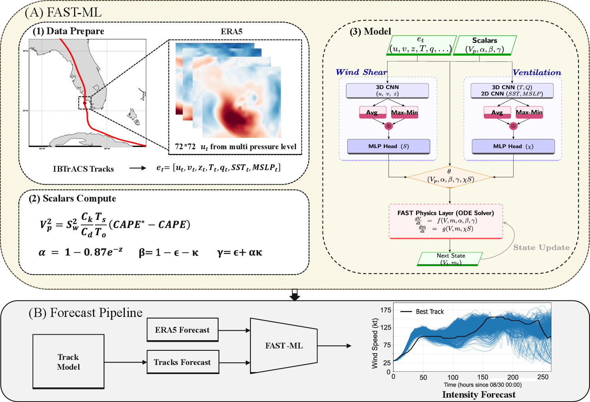
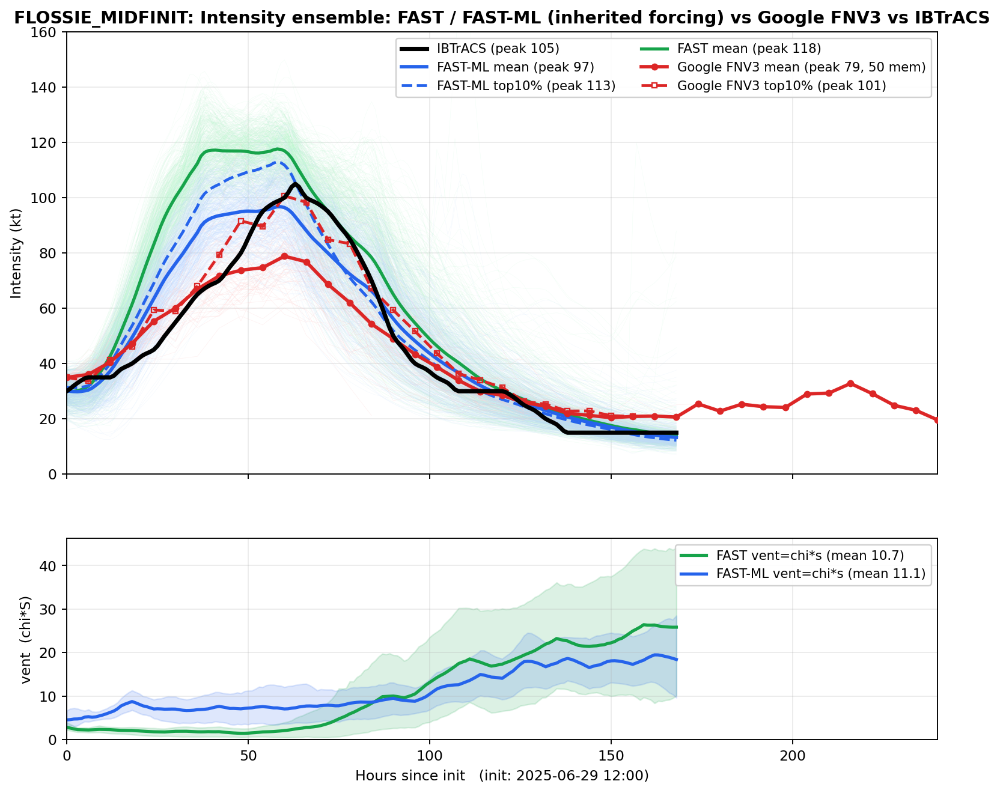
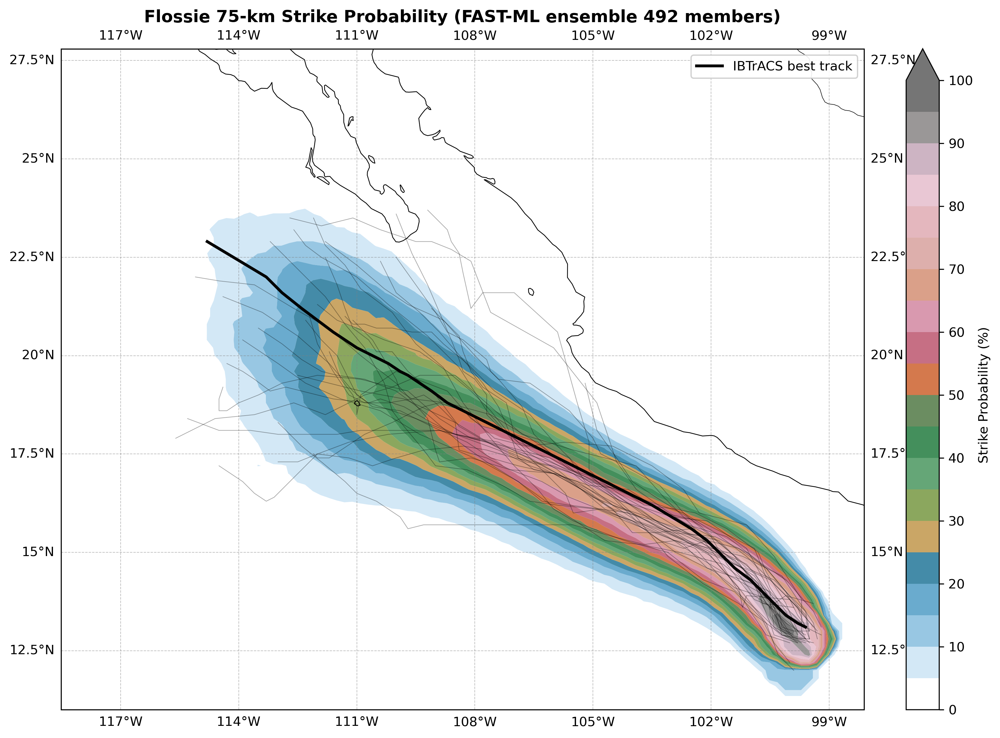
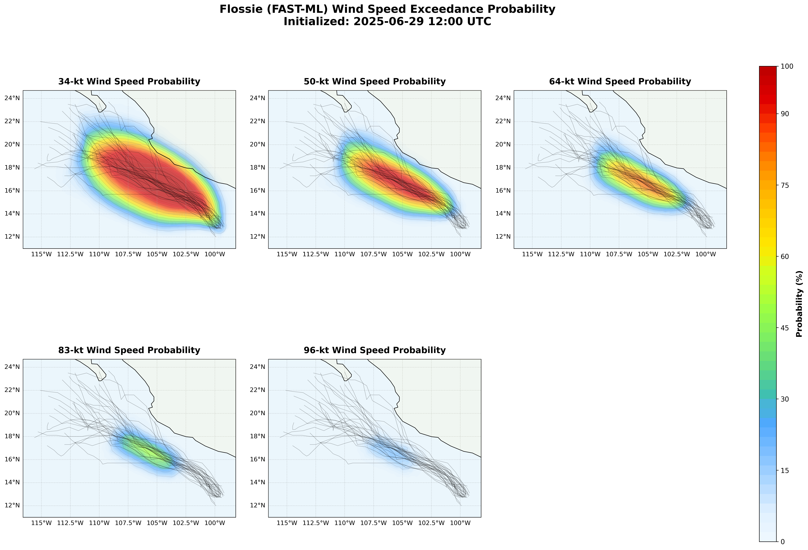
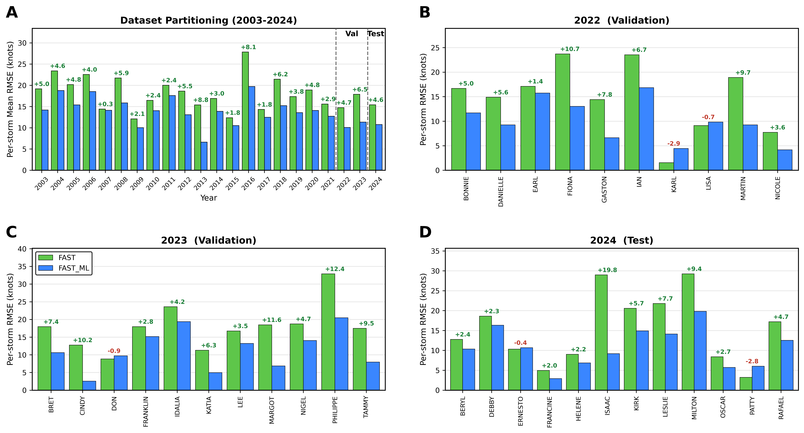

<div align="center">

# FAST-ML: Hybrid Physics–Machine Learning for Tropical Cyclone Intensity Forecasting

[-B31B1B)](#citation)
[](#installation-and-reproduction)
[](requirements.txt)
[](LICENSE)

**FAST-ML combines mechanistic tropical cyclone modeling with machine learning to
improve intensity prediction while preserving physical structure and enabling
probabilistic forecasting.**

```
Atmospheric State → Environmental Feature Extraction → Physics Model + ML Correction
        → FAST-ML Forecast → Probabilistic Ensemble → Extreme-Event / Tail-Risk Analysis
```

</div>



*The FAST-ML framework: a two-stream CNN diagnoses the environmental ventilation
terms from large-scale atmospheric fields, which drive a coupled physical
intensity model. Everything downstream of the learned diagnosis is physics.*

---

## Key Result — Held-Out 2024 North Atlantic Evaluation

> On the held-out 2024 North Atlantic hurricane season, FAST-ML reduced mean
> intensity RMSE from **15.42 kt to 10.78 kt**, corresponding to a **30.1%
> reduction** relative to the physics baseline. FAST-ML improved forecasts for
> **10 of 12** evaluated storms.

| Model              | 2024 RMSE |
|--------------------|----------:|
| Physics baseline (FAST) | 15.42 kt |
| FAST-ML            | **10.78 kt** |
| Relative reduction | **30.1%** |

The 2024 season is fully held out: neither the CNN weights nor the input
normalization statistics use 2024 data. Per-storm results in
[Evaluation](#evaluation).

## Why FAST-ML?

Tropical cyclone intensity prediction is difficult because storm evolution
depends on nonlinear interactions between environmental forcing, internal
storm dynamics, and uncertain initial conditions. Purely data-driven
forecasters can fit these interactions but discard physical structure;
purely physical models retain structure but misdiagnose the environment.

> Rather than replacing a physical intensity model with a purely data-driven
> predictor, FAST-ML learns systematic corrections to the physical forecast
> using large-scale atmospheric information.

The design keeps this separation strict: FAST (physics baseline) and FAST-ML
share a **byte-identical** intensity ODE, and differ *only* in where the
ventilation index `χ·S` — the environmental forcing term — comes from:

- **FAST** diagnoses it from coarse ERA5 reanalysis diagnostics;
- **FAST-ML** learns it from storm-centered atmospheric fields with a
  two-stream CNN.

Because everything downstream of `χ·S` is identical physics, the improvement
is attributable to a better environmental diagnosis, not to a black box
taking over the forecast. The neural network never sees or predicts the
intensity it is scored on; all temporal evolution comes from the ODE.

## Scientific Contributions

### 1. Hybrid Physics–ML Forecasting

Preserve mechanistic physical structure — a coupled potential-intensity ODE —
while learning systematic forecast discrepancies from atmospheric conditions.
The ML component corrects *how the environment forces the storm*, not the
storm's evolution itself.

### 2. Large-Scale Atmospheric Learning

The system operates on multi-year (2003–2024), hourly, ~0.25° ERA5 fields:
storm-centered 72×72 tensors of temperature, humidity, winds, geopotential
(7 levels), SST and MSLP — roughly 100 MB per storm — with a scientific
data-processing pipeline (verified downloads, normalization statistics,
per-storm NetCDF output) end to end.

### 3. Probabilistic Prediction

The deterministic hybrid forecast is extended to distributions: a GEFS-based
synthetic track ensemble drives FAST and FAST-ML member by member, yielding a
full intensity distribution rather than a point estimate. Retaining the ODE
means the spread is generated by physics, so the ensemble keeps the
right-skewed tail that a model trained toward the conditional mean damps out.

### 4. Extreme-Event and Tail Analysis

Probabilistic forecasts allow analysis of low-probability, high-impact
intensity outcomes: top-decile peak intensity, 75-km strike probability, and
wind-speed exceedance probabilities (34/50/64/83/96 kt). This bridges
physical forecasting toward decision-relevant risk estimation.

> FAST-ML is part of a broader effort toward hybrid scientific machine
> learning for nonlinear physical systems: **physics → learned
> residual/correction → probabilistic forecast → extreme-event risk**. The
> goal is not to replace physical modeling, but to combine physical
> structure with modern machine learning for improved prediction, uncertainty
> quantification, and extreme-event characterization.

## Method Overview

**Physics core.** A fast intensity model (Emanuel 2012; ventilation after
Tang & Emanuel 2012, Lin et al. 2023) integrates the coupled (V, m) system:

```
dV/dt = coeff * (α β vp² m³ − (1 − γ m³) V²)
dm/dt = coeff * ((1 − m) V − χ S m)
```

where `V` is intensity, `m` the fraction of the potential intensity realized,
and `χ·S` the ventilation index — the environmental suppression of the storm.
A spatially varying drag-coefficient field (`data/Cd.nc`) enters through
`coeff`.

**Learned environmental correction.** A two-stream CNN predicts the
ventilation terms from the atmospheric state, mirroring their physical
decomposition:

- **S stream** — from the wind and geopotential fields (U, V, Z): the
  shear-driven ventilation efficiency, a purely dynamical quantity;
  thermodynamic fields are deliberately withheld.
- **χ stream** — from the thermodynamic fields (T, Q, SST, MSLP) plus the
  FAST scalars: the entropy deficit of ventilated air.

Both are instantaneous diagnostics with no recurrence, so the network cannot
smuggle in a memory of observed intensity; temporal evolution comes entirely
from the ODE. A mean-to-90th-percentile factor and an Atlantic ceiling put
ERA5 and CNN ventilation indices on one scale.

**Forecast protocol.**

- **Time axis.** The forecast starts when the best track first reaches 45 kt;
  the preceding 48 h initialise the ODE.
- **Initialisation.** Over the 48 h window `V` is nudged onto the observation
  and the residual `F = observed acceleration − physics RHS` is recorded. From
  `t_start` the integration is free, with the inherited forcing decaying as
  `F * exp(−2 * (lead / 24 h)²)`.
- **Observation inversion.** Best-track winds include translation and
  shear-induced asymmetry; observations are inverted to axisymmetric form
  before use, and model output is converted back for scoring.

## Probabilistic Forecasting and Uncertainty

A GEFS-based synthetic track ensemble drives FAST and FAST-ML member by
member, giving a full intensity distribution to compare against the Google
WeatherLab FNV3 ensemble and IBTrACS. Retaining the ODE means the spread is
generated by physics, so the ensemble keeps the right-skewed tail that a
model trained towards the conditional mean damps out.



*Flossie (EP06 2025), initialised 2025-06-29 12:00, 492 members. Left: the
FAST-ML intensity ensemble with its mean and top decile against the 50-member
FNV3 ensemble and the best track. Right: per-member ventilation index. The
Priscilla case (460 members, free run) produces the same set of figures.*

### Strike probability and wind exceedance

The same ensemble feeds two probabilistic products, following the wind model
of Lin & Chavas as used in the reference implementation: the probability that
the storm centre passes within 75 km of a point over a 5-day window, and the
probability that the modelled wind speed exceeds 34/50/64/83/96 kt. The 31 raw
GEFS members are drawn as spaghetti; the probabilities use the full sampled
ensemble.

```bash
python scripts/plot_strike_probability.py --case all --model ml
```



*Flossie: 75-km strike probability of the 492-member FAST-ML ensemble, with
the 31 raw GEFS members as spaghetti.*



*Flossie: probability of the modelled wind speed exceeding 34/50/64/83/96 kt,
each panel zoomed to the track domain. The corresponding Priscilla maps are
written alongside these in `results/ensemble/`.*

## Evaluation

Performance is reported in three clearly separated regimes: a held-out
season, historical aggregate diagnostics, and prospective case studies. They
are not interchangeable — training and normalization use information from
2003–2022, so only the 2024 season (and the 2025 cases) are out-of-sample.

### Held-Out Evaluation — 2024 North Atlantic

RMSE against the IBTrACS best track over the full forecast period, in knots
(panel D of Figure 3):

| Storm | Obs peak | FAST | FAST-ML | Gain |
|---|---:|---:|---:|---:|
| BERYL | 145 | 12.78 | 10.35 | +2.42 |
| DEBBY | 70 | 18.60 | 16.32 | +2.28 |
| ERNESTO | 85 | 10.31 | 10.68 | −0.37 |
| FRANCINE | 90 | 4.96 | 2.92 | +2.04 |
| HELENE | 120 | 9.02 | 6.85 | +2.17 |
| ISAAC | 90 | 28.97 | 9.17 | +19.80 |
| KIRK | 130 | 20.59 | 14.90 | +5.69 |
| LESLIE | 90 | 21.78 | 14.11 | +7.67 |
| MILTON | 155 | 29.24 | 19.81 | +9.43 |
| OSCAR | 75 | 8.40 | 5.70 | +2.70 |
| PATTY | 55 | 3.21 | 6.03 | −2.81 |
| RAFAEL | 105 | 17.20 | 12.52 | +4.68 |
| **mean** | | **15.42** | **10.78** | **+4.64** |

Seven of the nineteen 2024 storms are excluded by the evaluation criteria: they
either never reach the 45 kt forecast threshold or have under 72 h of forecast
after it. `download_data.py --verify` reports which inputs are present, and
`--storm MILTON` runs a single storm.



### Historical Diagnostics — 2003–2024 Aggregate

Across all 224 North Atlantic storms of 2003–2024 that meet the same criteria,
FAST averages 18.20 kt and FAST-ML 13.87 kt (−4.33 kt), with FAST-ML better on
179 of the 224. **These are historical/aggregate diagnostics, not a fully
independent test set**: the training data and the normalization statistics
(`data/spatial_stats_train2003_2022.pkl`) span 2003–2022, so most of these
storms are in-sample. Scoring those years needs the full ERA5 archive, which
is not distributed; per-storm metrics for every run land in `results/` locally.

### Prospective Case Studies — 2025

FAST-ML is additionally evaluated against Google WeatherLab FNV3 ensembles on
selected 2025 tropical cyclone case studies to examine peak-intensity
estimates, ensemble behavior, and physically meaningful tail outcomes. Two
storms are case studies, not a systematic comparison.

| Case | Obs peak | FAST-ML mean | FAST-ML top 10% | FNV3 mean | FNV3 top 10% | FAST mean |
|---|---:|---:|---:|---:|---:|---:|
| Flossie (EP06 2025) | 105 | **97** | **113** | 79 | 101 | 118 |
| Priscilla (EP16 2025) | 100 | **95** | **108** | 85 | 98 | 81 |

Peak intensity in knots; "mean" is the peak of the ensemble-mean track and
"top 10%" that of the strongest decile. In these two cases the FAST-ML mean
lands within 5–8 kt of the observed peak against 15–26 kt for the FNV3 mean,
and the FAST-ML top decile brackets the observed peak while the FNV3 top
decile falls short of it in both cases. Pure FAST misses in both directions,
so the gain is a better ventilation diagnosis, not a one-sided bias
correction.

## Installation and Reproduction

Code and data for the manuscript submitted to *Journal of Advances in Modeling
Earth Systems* (JAMES). Inference only: the training loop and the derivation of
the ERA5 ventilation diagnostics are not part of this release.

```bash
git clone https://github.com/Shijie-Xiao/FAST_ML.git
cd FAST_ML
pip install -r requirements.txt
```

**Figures only — no download, no GPU, ~1 min.**

```bash
python scripts/run_single_track.py --replot-only
python scripts/plot_ensemble_vs_google.py --no-vent-panel
python scripts/plot_figure3.py
```

**With the ensemble ventilation panels — 53 MB.**

```bash
python scripts/download_data.py --ensemble
python scripts/plot_ensemble_vs_google.py
```

**Run the model end to end — 2.1 GB, ~1 min on a GPU.** Reruns the CNN and the
ODE and rewrites the NetCDF, figures and metrics from scratch.

```bash
python scripts/download_data.py --single-track
python scripts/run_single_track.py --years 2024 --basin NA
```

```
Storms evaluated          : 12  (7 skipped)
Mean RMSE, FAST           : 15.42 kt
Mean RMSE, FAST_ML        : 10.78 kt
Mean improvement          : +4.64 kt
Storms where FAST_ML wins : 10/12
```

### Data distribution

Everything needed to redraw the published figures is in git (about 30 MB): the
model weights, the drag coefficient field, the normalisation statistics, the
ensemble ODE output and FNV3 reference. Three larger files live on
[Google Drive](https://drive.google.com/drive/folders/1xS8JN65WVqhkvLeBnrNZBRg47XE4lIUf),
with ids and SHA-256 sums in `data/manifest.json`:

| File | Size | Needed for |
|---|---|---|
| `fastml_training_data_2024_NA.tar` | 2.1 GB | running the CNN on the 2024 season |
| `chi_s_flossie.nc` | 17 MB | ventilation panel, Flossie |
| `chi_s_priscilla.nc` | 35 MB | ventilation panel, Priscilla |

`download_data.py` verifies size and SHA-256 after each transfer. Training data
is not distributed — only the 2024 North Atlantic test season. The
normalisation statistics are part of the model definition and are committed
(`data/spatial_stats_train2003_2022.pkl`, under 1 KB).

## Repository Structure

```
fastml/   Two-stream CNN, FAST ODE, data loading, inference, I/O, plotting
scripts/  run_single_track, plot_ensemble_vs_google, plot_figure3,
          plot_strike_probability, download_data
ckpt/     Released weights (4.7 MB, strict load)
data/     Drag field, normalisation statistics, ensemble inputs, manifest
img/      Figures referenced by this README (manuscript figures + ensembles)
results/  Generated output — NetCDF, metrics, figures (gitignored)
```

## Data Sources

IBTrACS v04 best-track data (NOAA NCEI), ERA5 reanalysis (Copernicus Climate
Change Service), GEFS reforecasts (NOAA), Google WeatherLab FNV3 ensemble
forecasts.

## Citation

```bibtex
@article{xiao_fastml,
  title   = {{FAST-ML}: A Hybrid Physics--Machine Learning Framework for
             Tropical Cyclone Intensity Forecasting},
  author  = {Xiao, Shijie and Lin, Jonathan and Ehrmann, Thomas and
             Sarhadi, Ali},
  journal = {Journal of Advances in Modeling Earth Systems},
  note    = {Submitted},
  year    = {2026}
}
```

## License

MIT, see `LICENSE`.
