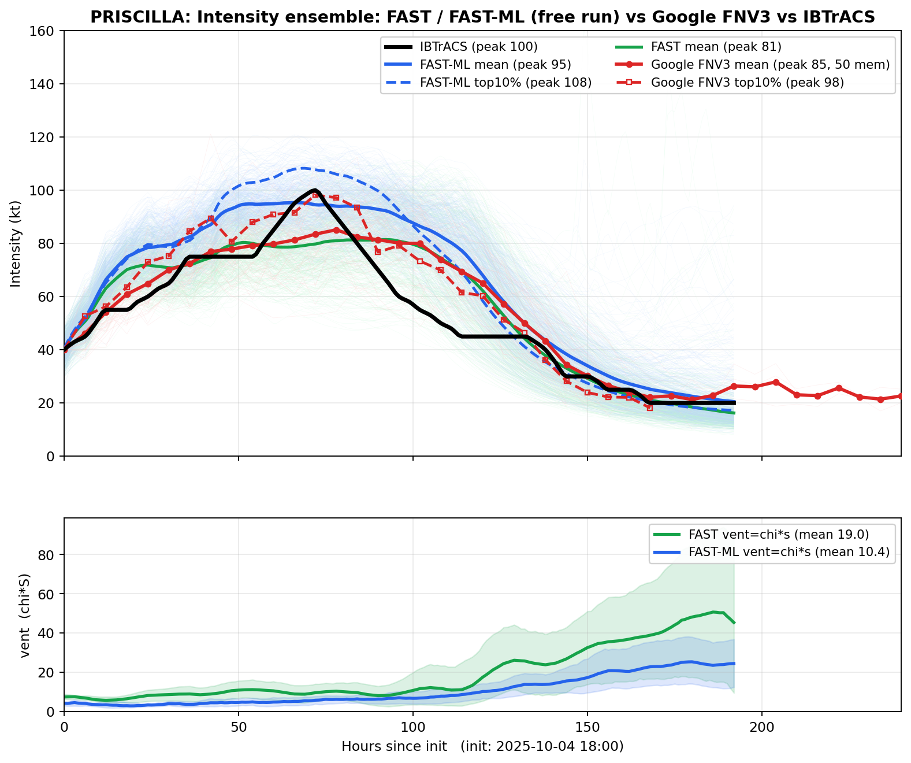

# FAST-ML: A Hybrid Physics–Machine Learning Framework for Tropical Cyclone Intensity Forecasting

[Shijie Xiao](https://shijie-xiao.github.io/)<sup>1</sup>, Jonathan Lin<sup>2</sup>,
Thomas Ehrmann<sup>3</sup>, Ali Sarhadi<sup>1</sup>

<sup>1</sup> Georgia Tech &nbsp;·&nbsp; <sup>2</sup> Cornell &nbsp;·&nbsp; <sup>3</sup> Sandia National Laboratories

Code and data for the manuscript submitted to *Journal of Advances in Modeling
Earth Systems* (JAMES). Inference only: the training loop and the derivation of
the ERA5 ventilation diagnostics are not part of this release.

FAST predicts tropical cyclone intensity by integrating a coupled ODE for the
axisymmetric wind `V` and a moisture variable `m`. Its dominant uncertainty is
the **ventilation index** `chi * S`, the rate at which low entropy environmental
air is stirred into the core, conventionally diagnosed from reanalysis. FAST-ML
replaces that diagnosis with a two-stream CNN on storm-centred ERA5 fields and
changes nothing else — same ODE, track, scalars, drag field and initialisation —
so any difference in skill is attributable to the ventilation diagnosis alone.

What the paper contributes:

- A hybrid design where the CNN diagnoses only ventilation and the ODE does all
  temporal integration, keeping the forecast physically constrained and the
  learned component interpretable.
- A mean 4.3 kt RMSE reduction over pure FAST across 224 North Atlantic storms
  from 2003 to 2024, improving 179 of them, and 4.6 kt over the 2024 test
  season, all with no change to the dynamics.
- Ensemble forecasts that beat Google WeatherLab FNV3 on recent rapidly
  intensifying hurricanes, where purely data-driven models damp the intensity
  tail.


## Reproduction

```bash
git clone https://github.com/Shijie-Xiao/FAST_ML.git
cd FAST_ML
pip install -r requirements.txt
```

**Figures only — no download, no GPU, ~1 min.** Redraws every published figure
from the archived NetCDF.

```bash
python scripts/run_single_track.py --replot-only
python scripts/plot_ensemble_vs_google.py --no-vent-panel
```

**Add the ensemble ventilation panels — 53 MB.**

```bash
python scripts/download_data.py --ensemble
python scripts/plot_ensemble_vs_google.py
```

**Run the model end to end — 2.1 GB, ~1 min on a GPU.** Reruns the CNN and the
ODE and rewrites the NetCDF, figures and metrics from scratch.

```bash
python scripts/download_data.py --single-track
python scripts/run_single_track.py --years 2024 --basin NA
```

```
Storms evaluated          : 12  (7 skipped)
Mean RMSE, FAST           : 15.42 kt
Mean RMSE, FAST_ML        : 10.78 kt
Mean improvement          : +4.64 kt
Storms where FAST_ML wins : 10/12
```

Seven of the nineteen 2024 storms are excluded by the evaluation criteria, and
the run reports why for each: they either never reach the 45 kt forecast
threshold or have under 72 h of forecast after it. `download_data.py --verify`
reports which inputs are present without fetching anything, and
`--storm MILTON` runs a single storm.

## Results


*(A) Per-year mean RMSE across 2003-2024 with the validation and test years
marked. (B, C) Per-storm RMSE for the 2022 and 2023 validation seasons. (D) The
2024 test season. Green is FAST, blue is FAST-ML; labels give the RMSE
reduction in knots.*

Across all 224 North Atlantic storms of 2003-2024 that meet the evaluation
criteria, FAST averages 18.20 kt and FAST-ML 13.87 kt, a reduction of 4.33 kt,
with FAST-ML better on 179 of the 224. Per-storm numbers for every year are in
`results/storm_metrics_all_years_NA.csv`.

Panel D is the season reproduced here, and its numbers are bit-identical to
those written by `run_single_track.py`. RMSE against the IBTrACS best track
over the full forecast period, in knots:

| Storm | Obs peak | FAST | FAST-ML | Gain |
|---|---:|---:|---:|---:|
| BERYL | 145 | 12.78 | 10.35 | +2.42 |
| DEBBY | 70 | 18.60 | 16.32 | +2.28 |
| ERNESTO | 85 | 10.31 | 10.68 | −0.37 |
| FRANCINE | 90 | 4.96 | 2.92 | +2.04 |
| HELENE | 120 | 9.02 | 6.85 | +2.17 |
| ISAAC | 90 | 28.97 | 9.17 | +19.80 |
| KIRK | 130 | 20.59 | 14.90 | +5.69 |
| LESLIE | 90 | 21.78 | 14.11 | +7.67 |
| MILTON | 155 | 29.24 | 19.81 | +9.43 |
| OSCAR | 75 | 8.40 | 5.70 | +2.70 |
| PATTY | 55 | 3.21 | 6.03 | −2.81 |
| RAFAEL | 105 | 17.20 | 12.52 | +4.68 |
| **mean** | | **15.42** | **10.78** | **+4.64** |

Bias, correlation and peak intensity per storm are in
`results/single_track/storm_metrics.csv`; the full time series are in
`results/single_track/netcdf/`.

Panels A to C cover the training and validation years, whose ERA5 inputs are
not distributed, so they cannot be regenerated from this release; panel D can,
and is the panel the released code is scored on.

## Ensemble forecasting

A GEFS-based synthetic track ensemble drives FAST and FAST-ML member by member,
giving a full intensity distribution to compare against the Google WeatherLab
FNV3 ensemble and IBTrACS. This is where the hybrid design pays off: retaining
the ODE means the spread is generated by physics, so the ensemble keeps the
right-skewed tail that a model trained towards the conditional mean damps out.

| Case | Obs peak | FAST-ML mean | FAST-ML top 10% | FNV3 mean | FNV3 top 10% | FAST mean |
|---|---:|---:|---:|---:|---:|---:|
| Flossie (EP06 2025) | 105 | **97** | **113** | 79 | 101 | 118 |
| Priscilla (EP16 2025) | 100 | **95** | **108** | 85 | 98 | 81 |

Peak intensity in knots; "mean" is the peak of the ensemble-mean track and
"top 10%" that of the strongest decile. The FAST-ML mean lands within 5-8 kt of
the observed peak against 15-26 kt for the FNV3 mean, and the FAST-ML top decile
brackets the observed peak while the FNV3 top decile falls short of it in both
cases. The top decile is reported alongside the mean because it is the part of
the distribution a rapid-intensification warning depends on. Pure FAST misses in
both directions — 13 kt high on Flossie, 19 kt low on Priscilla — so the gain is
a better ventilation diagnosis, not a one-sided bias correction.


*Flossie (EP06 2025), initialised 2025-06-29 12:00, 492 members, inherited
forcing retained. Left: the FAST-ML intensity ensemble with its mean and top
decile against the 50-member FNV3 ensemble and the best track. Right: the
per-member ventilation index.*



*Priscilla (EP16 2025), initialised 2025-10-04 18:00, 460 members, free run.
With no inherited forcing the entire spread comes from the ventilation
response.*

Steps 1-3 of the ensemble chain — storm-following extraction from the GEFS
archive, the per-member CNN pass producing `chi_s_<case>.nc`, and the per-member
ODE integration producing `ode_<case>.nc` — needed a multi-terabyte archive and
a GPU allocation, so their outputs are distributed rather than their inputs.
Step 4, the figure, is what this repository reproduces. The intensity panel
needs only files tracked in git; `chi_s_*.nc` supplies the ventilation panel.
`chi_s_priscilla.nc` archives 1000 members of which the first 460 were
integrated, so the plotting code truncates it to the members actually plotted.

## Data

Everything needed to redraw the published figures is in git (about 30 MB): the
model weights, the drag coefficient field, the normalisation statistics, the
ensemble ODE output and FNV3 reference, and the published NetCDF and figures.

Three larger files live in [Google Drive](https://drive.google.com/drive/folders/1xS8JN65WVqhkvLeBnrNZBRg47XE4lIUf),
with ids and SHA-256 sums in `data/manifest.json`:

| File | Size | Needed for |
|---|---|---|
| `fastml_training_data_2024_NA.tar` | 2.1 GB | running the CNN on the 2024 season |
| `chi_s_flossie.nc` | 17 MB | ventilation panel, Flossie |
| `chi_s_priscilla.nc` | 35 MB | ventilation panel, Priscilla |

The archive holds, per storm, `*_dataset.pkl` (track, observed intensity, FAST
scalars, ERA5 ventilation terms, environmental winds) and
`*_spatial_1000km.pkl` (the 72×72 storm-centred T/Q/U/V/Z on 7 levels plus SST
and MSLP that the CNN consumes). `download_data.py` verifies size and SHA-256
after each transfer, so a truncated download fails loudly rather than quietly
changing the results.

**Training data is not distributed** — only the 2024 North Atlantic test season,
which is what the published results are scored on. One consequence: the
normalisation statistics are derived from the 2003-2022 training storms and
cannot be recomputed from anything released here. They are part of the model
definition, so the file itself is committed
(`data/spatial_stats_train2003_2022.pkl`, under 1 KB) rather than left to be
regenerated.

## Reproduction fidelity

Verified by cloning into an empty directory, fetching the hosted files and
rerunning: the NetCDF output is bit-identical to the committed results for every
storm and variable, and the metrics CSV and ensemble legend values match
exactly. Figures are byte-identical when regenerated on the same machine, but
matplotlib's anti-aliasing is not bit-reproducible across machines, so compare
the NetCDF rather than the PNGs.

Two deliberate choices differ in the last digits from the internal version that
produced the manuscript. Track coordinates stay in float64 throughout, where the
internal pipeline briefly cast them to float32, perturbing the Coriolis
parameter and drag lookup at the 1e-4 kt level; this version is the more
accurate. And `vp_kts` in the NetCDF is the median-filtered series the ODE
actually integrates, where the internal version reported the unfiltered series
alongside a filtered integration.

## Method

**Time axis.** The forecast starts when the best track first reaches 45 kt; the
preceding 48 h initialise the ODE, so every sequence begins 48 h before that
threshold.

**Initialisation.** Over the 48 h window `V` is nudged onto the observation and
the residual `F = observed acceleration − physics RHS` is recorded, while `m`
spins up freely. From `t_start` the integration is free, with the inherited
forcing decaying as `F * exp(−2 * (lead / 24 h)^2)`, so the forecast does not
discard the momentum the storm already had.

**Observation inversion.** The best track reports maximum sustained wind, which
contains the storm translation and the shear-induced asymmetry, whereas the ODE
state is the axisymmetric mean. Observations are inverted to axisymmetric form
before use as a target and model output converted back for scoring.

**Ventilation calibration.** What matters is the driest air reaching the core,
not the annulus mean, so both paths apply the same mean-to-90th-percentile
factor and the same Atlantic ceiling, putting the ERA5 and CNN ventilation
indices on one scale.

**The two streams.** `S` is predicted from the wind and geopotential fields
(U, V, Z) and `chi` from the thermodynamic fields (T, Q, SST, MSLP), following
the physics: `S` is a shear quantity, `chi` an entropy deficit. Neither stream
is recurrent — both are per-timestep diagnostics — which keeps the network from
learning the observed intensity trajectory and forces all temporal evolution to
come from the ODE.

## Layout

```
fastml/
  config.py        Constants and thresholds, shared by both paths
  model.py         Two-stream CNN that diagnoses chi and S  (inference only)
  fast_physics.py  The FAST ODE, 48 h initialisation, wind conversion (NumPy)
  data.py          Storm loading, time alignment, normalisation
  inference.py     Runs FAST and FAST-ML over one storm
  netcdf_io.py     The single-track NetCDF product
  plotting.py      Single-track and ensemble figures
scripts/
  run_single_track.py         Single-track hindcast driver
  plot_ensemble_vs_google.py  Ensemble case-study figures
  download_data.py            Fetches the externally hosted files
ckpt/    Released weights (4.7 MB, 237 tensors, strict load)
data/    Drag field, normalisation statistics, ensemble inputs, manifest
img/     Manuscript figures, vector source plus PNG
results/ Published NetCDF output and figures
```

## Data sources

IBTrACS v04 best-track data (NOAA NCEI), ERA5 reanalysis (Copernicus Climate
Change Service), GEFS reforecasts (NOAA), Google WeatherLab FNV3 ensemble
forecasts.

## Citation

```bibtex
@article{xiao_fastml,
  title   = {{FAST-ML}: A Hybrid Physics--Machine Learning Framework for
             Tropical Cyclone Intensity Forecasting},
  author  = {Xiao, Shijie and Lin, Jonathan and Ehrmann, Thomas and
             Sarhadi, Ali},
  journal = {Journal of Advances in Modeling Earth Systems},
  note    = {Submitted},
  year    = {2026}
}
```

## License

MIT, see `LICENSE`.
